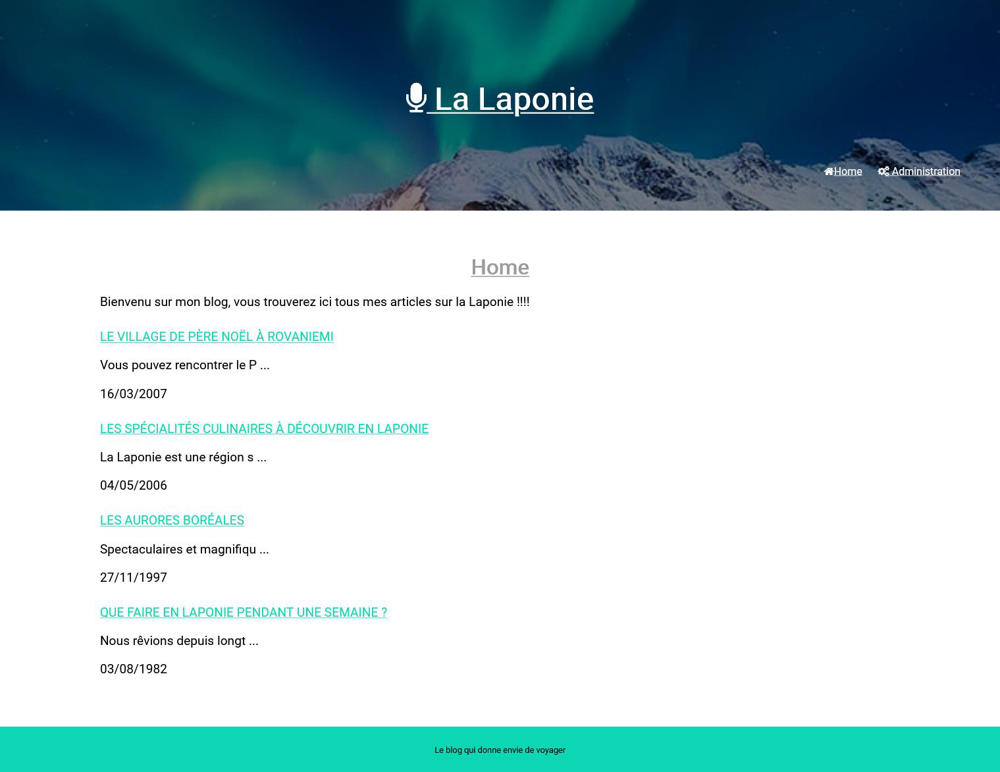

<h1 style="text-align: center;">
    NODEJS CREATION D'UN BLOG
</h1>

Vous allez devoir réaliser un blog sur le thème de votre choix, avec la charte graphique de votre choix.

Le blog devra implémenter les fonctionnalités suivantes :

> ##### BASE DE DONNEES

Articles, catégories et commentaires enregistrés en base de données.

> ##### **PAGE D'ACCUEIL** : 

La liste des articles avec le titre, la date et les 100 premiers caractères du texte

> ##### PAGE ARTICLES :

Lorsqu'on clique sur le titre d'un article de la page d'accueil, nous arrivons sur le détail de l'article avec les commentaires qui ont été postés et un formulaire pour ajouter un commentaire

> ##### LE **BACK OFFICE** (NON SECURISE POUR LE MOMENT)

Il offrira la possibilité de :
- Ajouter un article
- Modifier un article
- Supprimer un article
- Voir tous les articles

